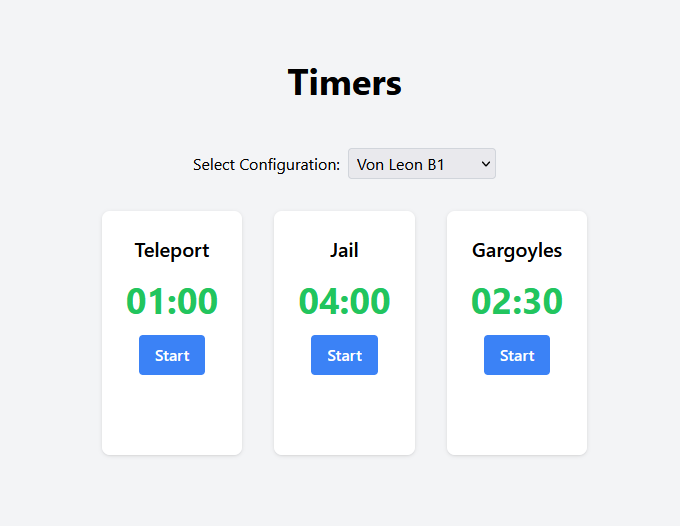

# Timer App

Timer App is a simple and customizable web application that allows users to manage multiple countdown timers. The app features adjustable timer durations, color changes for timers nearing their end, and Start, Stop, and Restart buttons. The timers can be configured using configuration files, making it easy to add, remove, or modify timers for various use cases.

A demo of the app can be found here: [https://1nefootstep.github.io/timer-app/](https://1nefootstep.github.io/timer-app/)



## Features

- Multiple countdown timers
- Configurable timer durations
- Customizable timer labels
- Toggle between different timer configurations
- Responsive design

## Technologies

- React
- Tailwind CSS

## Getting Started

### Prerequisites

- Node.js
- npm

### Installation

1. Clone the repository
```
git clone https://github.com/1nefootstep/timer-app.git
```

2. Change the directory to the timer app
```
cd timer-app
```

3. Install dependencies
```
npm install
```

4. Start the development server
```
npm start
```

5. Open your browser and navigate to [http://localhost:3000](http://localhost:3000)

## Configuration

The timer configurations are stored in `src/timerConfigs.js`. You can add, modify, or remove configurations by updating the array of timer objects in this file. Each configuration object has the following properties:

- `name`: The name of the configuration
- `timers`: An array of timer objects or separators. Timer objects have the following properties:
  - `duration`: The duration of the timer in seconds
  - `title`: The label to be displayed above the timer
  - `colorChangeThreshold`: The time in seconds before the timer color changes (defaults to 10 seconds)
  - `isSeparator` (optional): If set to `true`, a horizontal divider will be rendered between timers

Example:

```javascript
{
  name: "Custom Configuration",
  timers: [
    {
      duration: 90,
      title: "1 Minute 30 Seconds",
      colorChangeThreshold: 10,
    },k
    {
      duration: 180,
      title: "3 Minutes",
    },
    {
      isSeparator: true,
    },
    {
      duration: 120,
      title: "2 Minutes",
    },
  ],
}
```

In this example, a horizontal divider will be rendered between the second and third timers.
## Contributing

Pull requests are welcome. For major changes, please open an issue first to discuss what you would like to change.

## License

[MIT](https://choosealicense.com/licenses/mit/)

## Resources

Favicon: <a target="_blank" href="https://icons8.com/icon/64499/clock">Clock</a> icon by <a target="_blank" href="https://icons8.com">Icons8</a>
